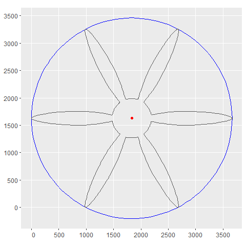
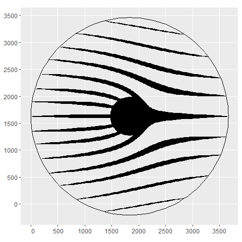
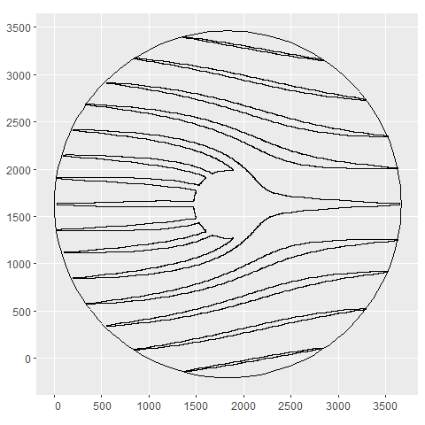
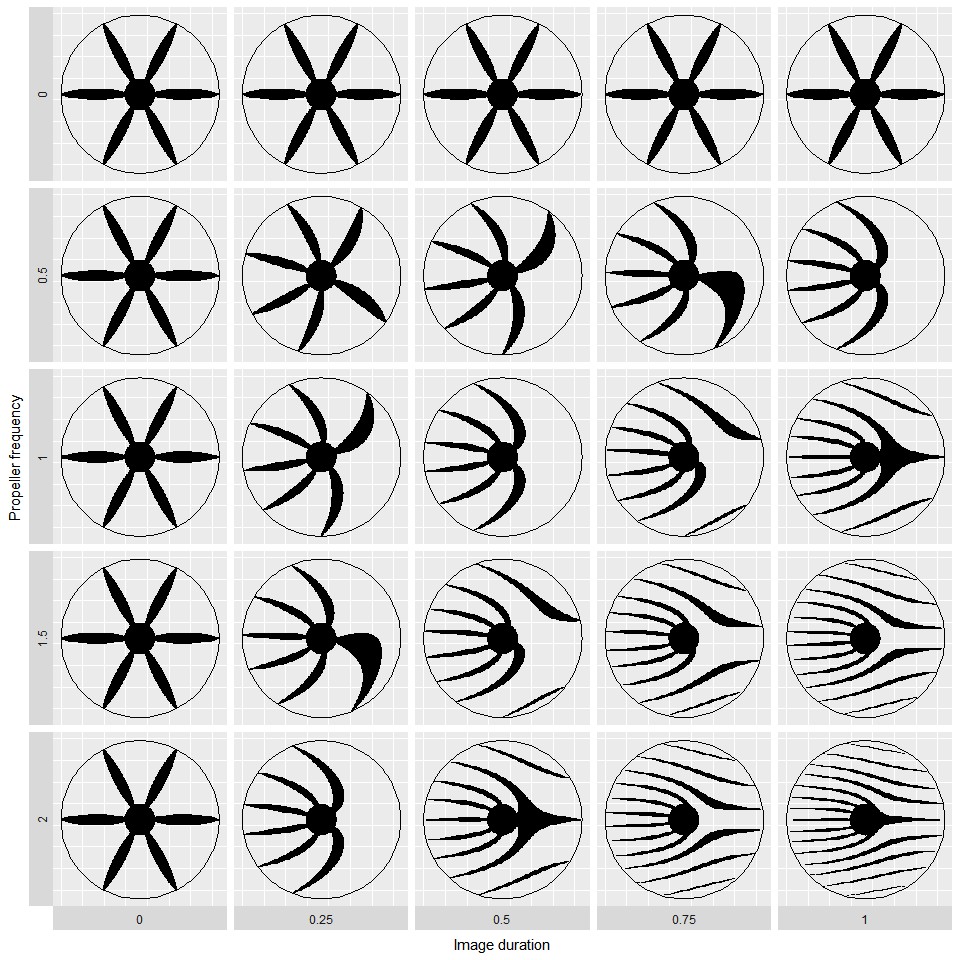

<!-- README.md is generated from README.Rmd. Please edit that file -->

# the rolling shutter and the propeller

``` r
library(tidyverse)
library(sf)
```

Read the propeller csv and convert to an `{sf}` polygon geometry.
Compute the cenroid and bounding boxes.

``` r
p <- 
  read_csv('propeller.csv') %>% 
  st_as_sf(coords = c("x", "y")) %>% 
  summarise(do_union = FALSE) %>% 
  st_cast("POLYGON") %>% 
  st_geometry()

# Centroid and bounding box
cntrd <- st_centroid(p)
bb <- st_bbox(p)

# Circle polygon with radius of largest dimension in bbox and it's bbox
rad <- cntrd %>% st_buffer((max(bb) - min(bb))/2)
bb_rad <- st_bbox(rad)
```

Visualise the propeller

``` r
ggplot() + 
  geom_sf(data=rad, fill=NA, col="blue") + 
  geom_sf(data = cntrd, col="red")+
  geom_sf(data = p, fill=NA)
```

<!-- -->

A function to rotate a geometry, taken from
<https://r-spatial.github.io/sf/articles/sf3.html>

``` r
rot <- function(a) matrix(c(cos(a), sin(a), -sin(a), cos(a)), 2, 2)
```

Develop some working code.

-   Generate a dataframe that has a row for each step of the picture.
-   For each row, the shutter `st_linestring` is moved one step, the
    propeller is rotated one step and the intersection of the two is
    computed.

``` r
# Resolution for time steps
res <- 500

# Shutter time (seconds)
shutter_time <- 1

# Propeller (rotations/second)
propeller_freq <- 2

# Create dataframe of each frame
d <- 
  tibble(time = seq(0, shutter_time, l=res),
         angle = seq(0, 2*pi*shutter_time*propeller_freq, l=res),
         shutter_position = seq(bb_rad["ymax"], bb_rad["ymin"], l=res),
         shutter = map(shutter_position,
                       ~st_linestring(matrix(c(bb_rad["xmin"], .x, bb_rad["xmax"], .x),
                                             nrow = 2, 
                                             ncol = 2, 
                                             byrow=TRUE)))) %>%
  mutate(prop = map(angle, ~(p - cntrd)*rot(.x) * 1 + cntrd)) %>% 
  mutate(i = map2(shutter, prop, ~st_intersection(.x, .y))) %>% 
  st_as_sf() %>% 
  st_set_geometry("i")

# Visualise
ggplot() + geom_sf(data = d) + geom_sf(data = rad, col=1, fill=NA)
```

<!-- -->

Loop through all frames saving image output for animation. Animation
made outside of R using ImageJ.

``` r
for(i in 1:nrow(d)){

  ggplot()+
    geom_sf(data = d$prop[[i]], col=NA)+
    geom_sf(data = d$i[1:i])+
    geom_sf(data = d$shutter[i], col="blue")+
    geom_sf(data = rad, col=NA, fill=NA)+
    theme_minimal()

  ggsave(paste0('out/', i, '.png'), width=5, height=5, dpi=200)
}
```


As an aside - I wanted to see if I could convert the image to a polygon
by buffering all of the linestrings

``` r
# Compute buffer size
buff <- mean(diff(seq(bb_rad["ymax"], 0, l=res))/2) %>% abs() %>% ceiling()

ggplot() + 
  geom_sf(data = rad, fill=NA, col=1)+
  geom_sf(data = d$i %>% st_buffer(buff) %>% st_union(), col=1, fill=NA)
```

<!-- -->

Convert code into a function

-   Add a starting offset angle

``` r
prop <- function(prop_freq=1, duration=1, offset=0, res=200){
  
  p <- (p - cntrd)*rot(offset) * 1 + cntrd
  
  tibble(time = seq(0, duration, l=res),
         angle = seq(0, 2*pi*duration*prop_freq, l=res),
         shutter_position = seq(bb_rad["ymax"], bb_rad["ymin"], l=res),
         shutter = map(shutter_position,
                       ~st_linestring(matrix(c(bb_rad["xmin"], .x, bb_rad["xmax"], .x),
                                             nrow = 2, 
                                             ncol = 2, 
                                             byrow=TRUE)))) %>%
    mutate(prop = map(angle, ~(p - cntrd)*rot(.x) * 1 + cntrd)) %>% 
    mutate(i = map2(shutter, prop, ~st_intersection(.x, .y))) %>% 
    st_as_sf() %>% 
    st_set_geometry("i")
}
```

Run the function across combinations of propeller frequency and image
duration

``` r
crossing(freq = seq(0,2,l=5),
         duration = seq(0,1, l=5)) %>% 
  mutate(d = map2(freq, duration, ~prop(.x, .y, res=200))) %>%
  unnest(d) %>%
  st_as_sf() %>% 
  st_set_geometry("i") %>% 
  ggplot() + 
  geom_sf() + 
geom_sf(data = rad, fill=NA, col=1)+
  facet_grid(freq ~ duration, switch = "both")+
  theme(axis.text = element_blank(),
        axis.ticks = element_blank())+
  labs(y = "Propeller frequency", x = "Image duration")
```

<!-- -->
